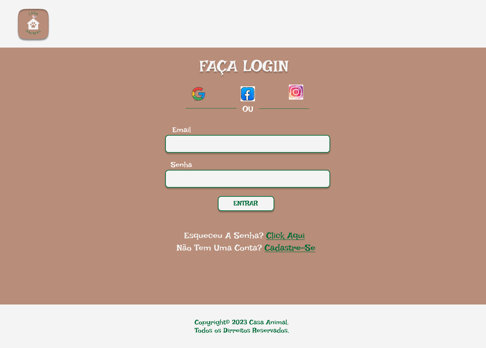

<h1 align="center"> Pagina Login </h1>

 Pagina Sendo Desenvolvida para o Projeto "Casa Animal"  

  <a href="#-tecnologias">Tecnologias</a>&nbsp;&nbsp;&nbsp;|&nbsp;&nbsp;&nbsp;
  <a href="#-projeto">Projeto</a>&nbsp;&nbsp;&nbsp;|&nbsp;&nbsp;&nbsp;
  <a href="#-layout">Layout</a>&nbsp;&nbsp;&nbsp;|&nbsp;&nbsp;&nbsp;

 

  

## 🚀 Tecnologias

Esse projeto foi desenvolvido com as seguintes tecnologias:

- HTML e CSS
- Git e Github
- Figma

## 💻 Projeto

Casa Animal, é um projeto de um E-commerce, voltado para pet's.
Projeto ainda em desenvolvimento.
Aqui está só uma pequena parte do projeto.
Pagina Login, com link's para mais duas paginas. Uma de recuperação de senha, e outra de cadastro.

- [Visite o projeto online] (https://willersoares.github.io/New-Pags/)

## 🔖 Layout

Você pode visualizar o layout do projeto através [DESSE LINK](https://www.figma.com/file/RUciDSokT1OA0ireW9llif/P%C3%A1gina-login?node-id=0%3A1&t=P82SLrkjqymu9LQM-1). É necessário ter conta no [Figma](https://figma.com) para acessá-lo.